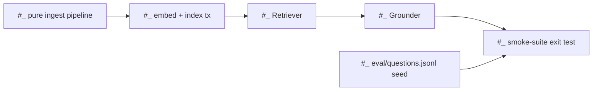

# roadmap-to-issues

Turn the design docs into GitHub issues the same way the tutor answers questions: **grounded**
(every issue cited to a doc span), **honest** (uncited scope is flagged, never smuggled in), and
**coordinated** (dependencies + mutual exclusion mapped so three people work in parallel without
colliding). Docs are source of truth; this skill is a one-directional projection onto GitHub.

## When to use
- Planning the work for the current phase (slice or spike pass), or refreshing the board after one
  closes.
- "Make the issues", "turn the roadmap into issues", "what's ready to pick up".

## Source of truth (read these first, every run)
1. `CLAUDE.md` → **Current status** — the anchor for *which phase we're in* (slice, or spike pass).
2. `design/roadmap.md` — that phase's `Build` bullets and `Exit` criterion.
3. `design/decisions/*.md` (ADRs) and `design/components/{grounder,retriever,ingestion-worker}.md`
   — the contracts each task must cite.

**Halt on conflict.** If CLAUDE.md status and roadmap.md disagree about the current phase, stop and
surface the disagreement — do not guess (mirrors the repo's source-of-truth rule).

## Scope
Default: **current phase only** (from CLAUDE.md status). Re-run as phases complete. `--phase <phase>`
or `--all` overrides. `--create` actually writes to GitHub; without it the skill is dry-run.

**`<phase>` below means the run's own scope label, derived — never assumed to be a `slice-N`.** A
slice projects as `slice-N`; a spike pass projects as `spike-pass-N`, which ADR 0022 sequences as a
phase rather than a slice. A spike-pass row carries **no `slice-N` at all** — the Spike Pass 1
projection stamped `spike-pass-1` and no slice label — so anything keying on `slice-N` literally
misses the whole phase. Same reasoning as step 8.1: read the label off the run, not off a family
written down here.

---

## Procedure

### 1 — Anchor
Read the source-of-truth docs. Identify the current phase and **resolve `<phase>` from it** —
`slice-N` for a slice, `spike-pass-N` for a spike pass. Every step below keys on that one value; it is
resolved here once and never re-guessed. Halt on conflict.

### 2 — Pass 1: decompose along mergeable seams
Break the phase's `Build` bullets into tasks. **The unit is a chunk of surface area two people can
work without colliding — not a concept.** Split by module/file seam (Grounder module vs Retriever
module), never into pieces that all churn the same file. If a clean seam doesn't exist, keep the
pieces together as a **group** (see step 5), don't force a split.

**Two failures live here, and they pull in opposite directions — diagnose before acting.**

- **Under-split:** a task spans files with *different* owners and no shared state. The smoke-runner
  row is the cautionary case — `ask()`, the scoring module, and the runner script are three files,
  three review surfaces, and one issue. A real seam that the projection walked past. **Fix: split.**
- **Over-split (worse):** a task looks big, so it gets cut into pieces that all churn one file. Ship
  those as N PRs and N−1 of them merge a module that does not run — more review work than the single
  diff, and no intermediate state anyone can exercise. **Fix: leave it whole and give it a PR plan
  (below).**

Test before splitting: **would each piece merge into something that runs?** If no, it is not a task
boundary, it is a commit boundary. Say so in the body rather than on the board.

**PR plan for any task over ~3 checklist items.** A big issue is not a problem; a big issue that
arrives as a wall is. Annotate the checklist with where to cut, so it reads as a merge sequence:

```
- [ ] ② build labeled context [S#] + server-side map (ADR 0015)     — PR 1
- [ ] single generate() call; prompt + coverage marker (ADR 0014)   — PR 1
- [ ] parse [S#] + coverage marker                                  — PR 2
- [ ] validate (V1-structural): labels, zero-cite guard, marker     — PR 2
- [ ] decide state + fail-safe (ADR 0014/0016)                      — PR 3
```

**This is a plan, not tracked state — and that distinction is the whole point.** The issue stays the
single writer for "is this done"; the annotations are advice to whoever picks it up, and nothing
recomputes or reconciles them. Promoting them to tracked units (sub-issues, per-item tickets) creates
a second writer for one fact, which is the drift this repo is built to avoid — and it buries the
ready-frontier under rows that were never independently pickable.

### 3 — Pass 2: ground & verify (two-way)
- **Precision (no hallucination):** every task must cite a specific doc span (roadmap bullet / ADR /
  component-spec line). A task with no citation is marked `⚠ ungrounded — inferred beyond docs` and
  **surfaced separately**, never auto-added. (Two flavors to distinguish for the human: out-of-scope
  noise vs. a real gap the docs under-specify — the latter is often the most valuable output.)
- **Recall (no gaps):** every `Build` bullet and the `Exit` criterion must map to ≥1 task. Anything
  uncovered is flagged `✗ gap — no issue covers this`.

### 4 — Provenance
Each issue carries the block in Templates → *Provenance*. The phase's `Exit` line becomes the issue's
**Acceptance** (verbatim) — this is also its definition-of-done for dependency purposes.

### 5 — Coordination
- **Dependencies:** derive `Depends on` / `Blocks` from pipeline order. A dependency clears only when
  the blocker is **closed** (= finished *and* tested), not merely PR'd.
- **Mutual exclusion:** each task declares `Touches:` (file globs from the component specs). Two tasks
  are `parallel-safe` iff footprints are disjoint. Overlap → serialize (add a dep edge) or group.
- **Groups:** tasks that can't be made disjoint become **one group epic**, one owner, sub-tasks as a
  checklist inside — not N racing issues. Carry the **PR plan** from step 2 on that checklist: a group
  is precisely the case where the pieces share a file, so its owner needs the merge sequence spelled
  out. The checklist is the plan; the issue's open/closed is still the only tracked fact.
- **Readiness:** label each issue `ready` (no open blockers) or `blocked`.

### 6 — Reconcile against GitHub (idempotency)
A re-run is a **reconcile**, not a fresh create. First pull existing state:
`gh issue list --state all --label <phase> --json number,title,state,labels,body`. Match a proposed
task to an existing issue by its hidden marker `<!-- gct:<phase>:<task-slug> -->`.

**This fetch is the only thing that populates the match set, so getting `<phase>` wrong does not
degrade — it silently reclassifies every existing issue as `new` and re-creates the whole board.**
There is no second lookup to catch it: both keys below are checked against *these* rows and nothing
else. Confirm the fetch returned the rows you expect before trusting a `new` classification.

> Marker matching: `gh --search` tokenizes on `:`, so don't trust a raw `--search "gct:<phase>:slug"`.
> Match against the fetched `body` field yourself (substring), and additionally stamp each issue with a
> per-task label `task:<slug>` at create time as a reliable secondary key.

Then classify every task and act:
| Case | Condition | Action |
|---|---|---|
| **exists-closed** | marker found, issue closed | skip — never resurrect finished/tested work |
| **exists-open** | marker found, issue open | keep; **recompute coordination** (see below) |
| **new** | no marker match | propose as a new issue |

**Coordination recompute (the point of re-running).** For every `exists-open` issue:
- flip `blocked → ready` when all its `Depends on` are now **closed** (closed = finished *and* tested);
- refresh its `Depends on` / `Blocks` / `Touches` if the docs changed;
- refresh the **epic**: redraw the Mermaid graph, re-tick the checklist, drop closed children from the
  ready-frontier.

Re-run therefore *advances the board* (opens the frontier as deps close) — it does not just avoid dupes.
In dry-run these are shown as proposed label/edit changes; they are applied only under `--create`.

### 7 — Dry-run report (default)
Print, and stop for approval:
- **Reconcile summary:** N exists-closed (skipped) · N exists-open · N new · label changes queued.
- **Issue table** (new + changed): title · labels · Touches · Depends-on · citation.
- **Coverage report:** ✅ grounded · ⚠ ungrounded (with flavor guess) · ✗ gaps.
- **DAG preview:** the ready-frontier — what's pickable *now*, including any freshly-unblocked issues.

### 8 — Apply (only with `--create` + approval)
1. **Bootstrap every label the plan uses — derived from step 7's issue table, never from a stored
   list.** `gh issue create` **fails the whole create** on an unknown `--label`: it does not warn and
   continue, and it does not create the issue minus the label. So a missing label is not a cosmetic
   gap, it is four dead creates in a row.

   A stored list is exactly the wrong shape here, and it failed the first time it was tested: step 8.3
   below stamps a per-task `task:<slug>` key on every child, and no static list can contain a slug
   that is invented by the projection it is meant to precede. The Spike Pass 1 run also needed a
   *phase* label (`spike-pass-1`) that no `slice-N` enumeration covers.

   Take the **union of labels across every issue about to be created or edited**, diff it against
   `gh label list`, and create the missing ones *before* the first `gh issue create`:

   ```sh
   gh label create "<name>" --color <hex> --description "<what it keys>"
   ```

   Two conventions worth matching rather than re-inventing: reconcile keys are `--color c5def5
   --description "reconcile key"`, and a phase label reuses its family's color (`spike-pass-2` is
   `7057ff`, so `spike-pass-1` is too). Read the union off the table you just printed — *not* from
   the taxonomy section below, which documents what labels **mean**, not which ones this run needs.
2. **Reconcile existing:** apply the queued `blocked→ready` relabels and coordination edits from step 6;
   refresh the epic graph/checklist. (Never reopen or edit `exists-closed` issues.)
3. **Create new:** the epic (if absent) then new children, wiring `Depends on` / `Blocks` numbers,
   stamping the `task:<slug>` label + hidden marker, and checking children into the epic's task list.
4. Re-print final state with issue numbers and the new ready-frontier.

---

## Templates

### Provenance block (every issue)
```
── Provenance ──
Source:     design/roadmap.md → Slice N (or Spike Pass N), "<build bullet>"
ADRs:       0019 (chunking never-span), 0008/0014-0016 (grounder)
Spec:       design/components/grounder.md
Invariants: owner_id AND class_id filter · citation spine
Acceptance: <the phase's Exit criterion that this task satisfies, verbatim>
```

### Coordination block (every issue)
```
── Coordination ──
Depends on: #12 (closed = tested)   Blocks: #15
Parallel-safe with: #14             Touches: src/gct/grounder/**
Group: none                         Status: ready
Claim: assign yourself when you pick this up.
```

### Epic issue (one per phase)
Title: `[Slice N] <name>` for a slice, `[Spike PN] <name>` for a spike pass · labels `epic`,
`<phase>`. Body:
- one-line goal + the `Exit` criterion,
- a **Mermaid** dependency graph of the children,
- a task-list checklist of child issues,
- the ungrounded/gap flags from Pass 2, so the whole team sees open design questions.



## Label taxonomy — what the labels *mean*
**Not a bootstrap checklist.** Step 8.1 derives what to create from the run's own issue table;
reading it from here instead is how the `task:<slug>` keys got missed.

`slice-0`..`slice-4` (which slice) · `spike-pass-1` / `spike-pass-2` (which spike pass — a phase, not
a slice; ADR 0022 sequences them, and a row can carry one without any `slice-N`) · `spike` · `epic` ·
`group` · `ready` / `blocked` (dependency frontier) · `task:<slug>` (per-issue reconcile key, one per
task, invented by the projection). Assignment (native GitHub) = claiming; no `wip` label needed.

## Dependency representation
Body text + `ready`/`blocked` labels + the epic's Mermaid graph. No GitHub sub-issues/issue-types
beta — works for all three collaborators with zero repo setup, and labels recompute on re-run.

## Guardrails
- Dry-run is the default; nothing hits GitHub without `--create` **and** explicit approval.
- Never invent scope: uncited tasks are surfaced, not created.
- Never duplicate: dedup marker check before every create.
- Halt, don't guess, when the docs conflict.
