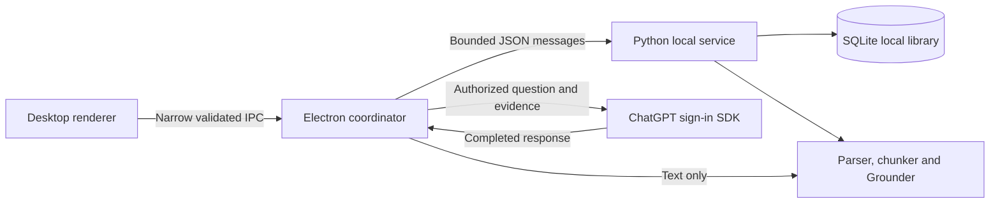

# Local desktop architecture

ADR 0033 is authoritative for the local pivot. Implementation advances through
reviewed PRs; the roadmap distinguishes the account proof, local library and
packaged release gates.

Electron owns account credentials, account/catalog state, dialogs, model traffic,
and cancellation. The renderer receives IDs and safe display state, not tokens,
arbitrary filesystem paths or a general network bridge. Python receives source
material and generation messages, not provider credentials or `.env` configuration.

The Python service owns parsing, source/chunk provenance, transactional library
operations, class-scoped search and Grounder decisions. Keep the existing pure
parser, chunker, Grounder and evaluation logic. A neutral retrieval contract lives
outside database adapters. The old Postgres retriever is not a core dependency.

Use a bounded subprocess per operation initially. A single-instance desktop app
with SQLite does not need an HTTP server, distributed worker, leases or a reaper.
Parsing remains isolated behind limits and a deadline. Parser limits do not create
an OS sandbox. Shutdown cancels work, reaps children, waits for credential rotation
persistence, and removes only app-owned temporary files.

The library belongs to the local OS user, independently of the selected ChatGPT
account. Store original bounded document bytes with metadata, extracted pages,
chunks and a rebuildable full-text index in SQLite. One transaction publishes a
complete import. Temporary copies are for parsing or source opening, not durability.
Preserve the existing app-data location so the already-authorized connection survives.

Local full-text retrieval is the initial zero-service baseline. It is class-scoped
and bounded, with explicit selected-page mode retained for comparison. Ranking
scores are not probabilities or grounds for claiming support. Empty retrieval,
unsupported content, provider errors and corrupt storage remain different outcomes.

Inference uses the existing subscription SDK. No API-key fallback, paid embeddings,
or hosted file-search service is introduced. No generation occurs on import or
startup. Only an explicit question sends the bounded evidence to the provider.

A packaged release must bundle its Python runtime and dependencies and work without
the source checkout. Until clean-machine installation is verified, call the runnable
source application a development build.
