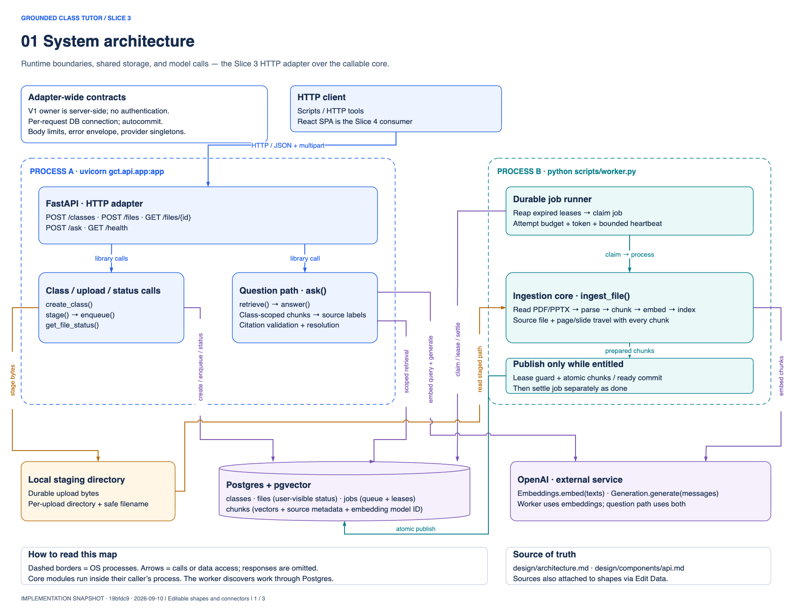
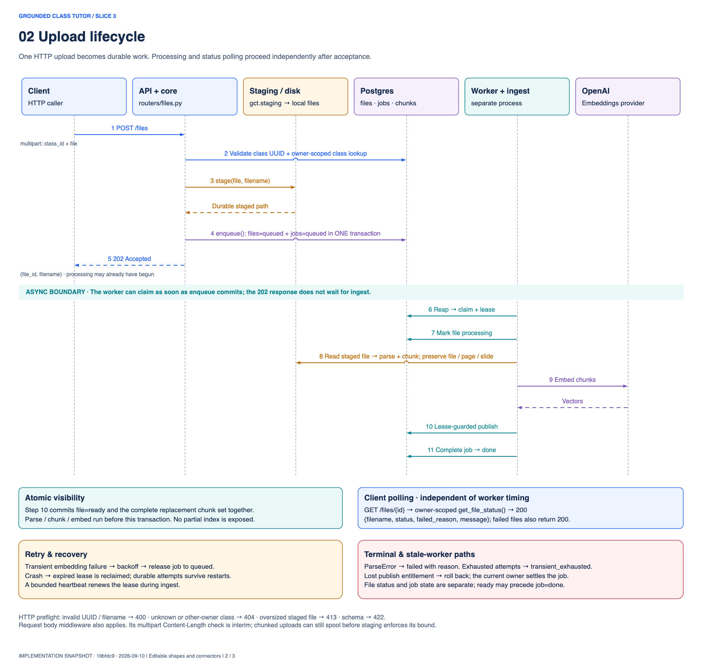
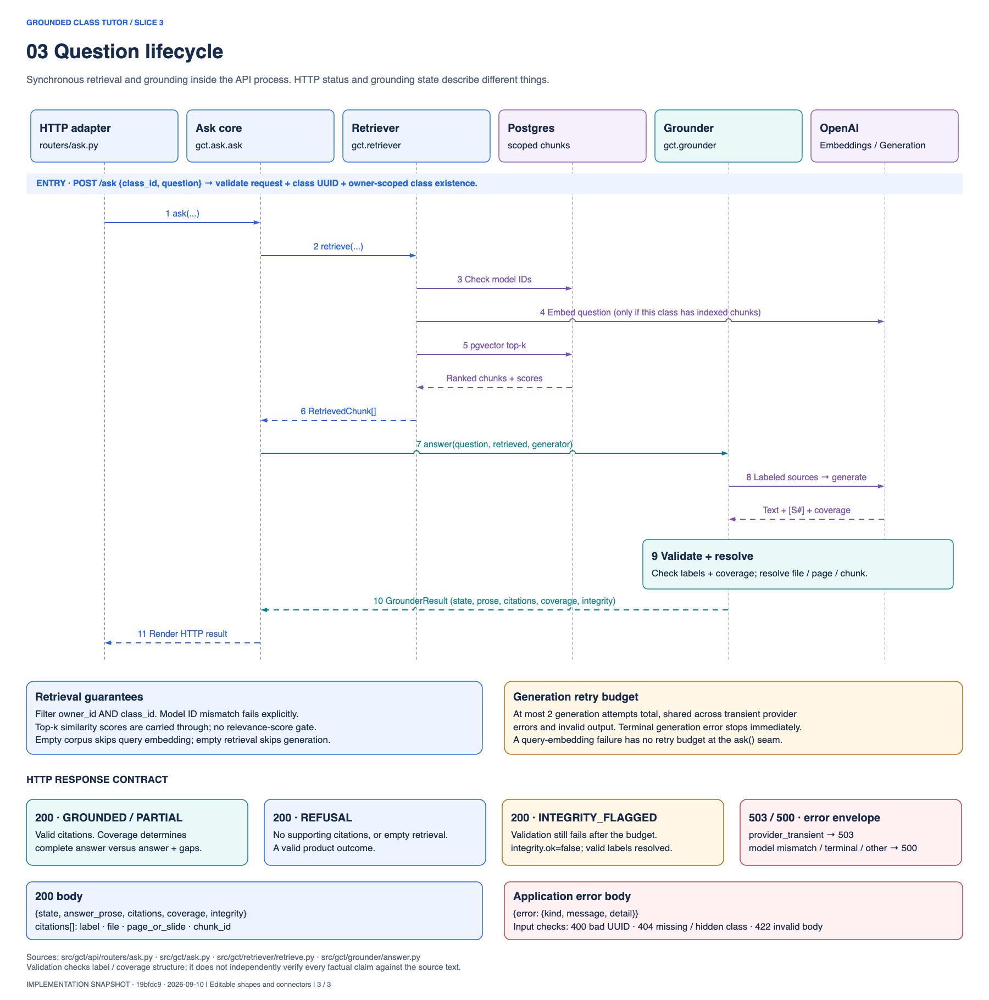

# Slice 3 API diagrams

> Historical hosted architecture. ADR 0033 supersedes this document where it conflicts with the
> [local architecture](../architecture.md) and [local roadmap](../roadmap.md). Source paths
> for retired server components refer to Git revision `0b004e7`, not the current runtime.

Open **[slice-3-api.drawio](slice-3-api.drawio)** in draw.io / diagrams.net. The file contains three pages with editable shapes, text, and connectors. Component shapes carry source references in their **Edit Data** metadata.

These diagrams are a derived implementation snapshot of commit `19bfdc9` on 2026-09-10. They explain the Slice 3 boundary and the core it calls; the React SPA is identified as a Slice 4 consumer. These diagrams are retained as historical evidence. The [local architecture](../architecture.md) and ADR 0033 define the current product; do not refresh this hosted snapshot to guide new work.

## 1. System architecture

API and worker process boundaries, callable core modules, local staging, Postgres/pgvector, and external model calls. Arrows show calls or data access; return values are omitted here.

[SVG](slice-3-api-1.svg) · [PNG](slice-3-api-1.png)

## 2. Upload lifecycle

Multipart upload, durable staging, transactional enqueue, HTTP 202, background ingestion, atomic publication, job completion, polling, retries, and terminal failures. The worker can start immediately after enqueue commits, before the HTTP response reaches the client.

The sequence combines the staging callable and local disk in one lane. The worker reads the staged file; it does not call the API's stager. File status and queue state are distinct: a published file can be ready before its job is settled as done.

[SVG](slice-3-api-2.svg) · [PNG](slice-3-api-2.png)

## 3. Question lifecycle

Validation, owner/class-scoped retrieval, embedding consistency, source labeling, generation, citation resolution, the shared retry budget, and the HTTP response contract. The numbered sequence shows the nonempty-corpus path; the notes describe empty retrieval and failure paths. Some routine return messages are omitted for readability.

Grounding validation checks citation-label and coverage structure; it does not independently establish that every factual claim is supported by a source. A refusal is a valid HTTP 200 result. Provider and configuration failures use an error envelope with 503 or 500.

[SVG](slice-3-api-3.svg) · [PNG](slice-3-api-3.png)

## Historical implementation references

The following modules refer to the preserved `0b004e7` revision:

- HTTP composition and routes: `src/gct/api/`.
- Upload and scheduling: `src/gct/staging.py`, `src/gct/jobs/`.
- Ingestion and publication: `src/gct/ingest/pipeline.py`, `src/gct/ingest/index.py`.
- Question path: `src/gct/ask.py`, `src/gct/retriever/retrieve.py`.
- The reusable Grounder remains at [answer.py](../../src/gct/grounder/answer.py).

The draw.io XML was decoded with draw.io's renderer, all three rendered pages were visually inspected, and connector references were checked. No application code was changed and no model calls were made.
